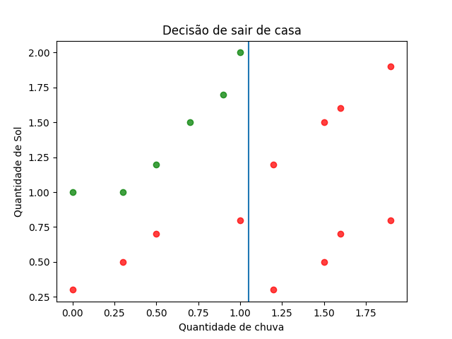
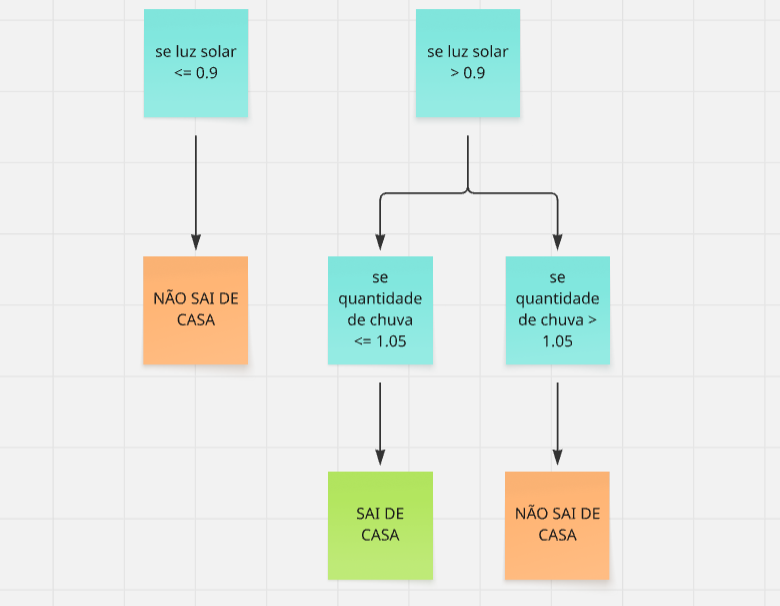
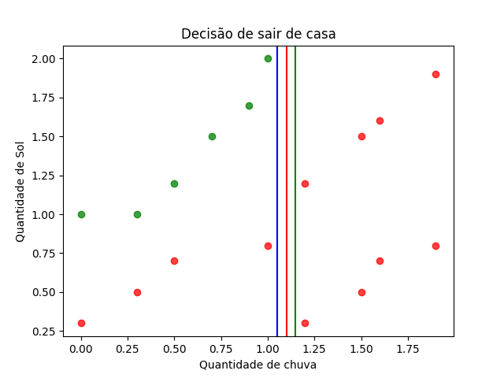
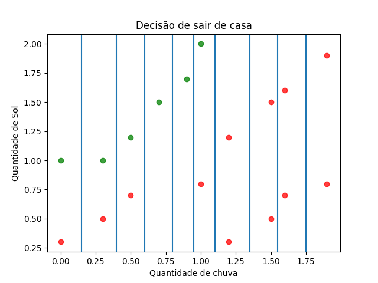

# Decision tree

Esse projeto foi concebido com a ideia de aperfeiçoar meus conhecimentos no funcionamento de algoritmos de ML, mais especificamente em arvores de decisão que é um algoritmo base para muitos outros como randon forest e arvores com gradient boosting, Nele foi construido do zero o código para gerar uma arvore de descisão e usa-la para fazer predições com dados tabulares reais e posteriormente foi comparado o resultado com a biblioteca scikit-learn que é muito usada no mercado para atestar a eficiencia do algoritmo construido. O resultado final foi que na maioria dos casos o algoritmo obteve desempenho muito parecido ou igual ao do scikit-learn

## requesitos para rodar o código:
    python
    Numpy
    Pandas
    Sklern

## caso queria testar em um DataSet próprio:
    (em construção)

## Como arvores de descisão funcionam:
Para começar a entender como arvores de decisão funcionam vamos imaginar o seguinte exemplo: queremos saber qual a chance de uma pessoa sair de casa em um dia baseado na quantidade de chuva (eixo x) e na quantidade de luz solar (eixo y), de forma que temos o gráfico a baixo onde os pontos verdes são pessoas que sairam de casa e os vermelhos são pessoas que não sairam de casa

A pergunta é: Como podemos separar esses grupos?
uma forma muito simples de fazer isso seria separar os grupos usando retas da seguinte forma:

Olhando primeiramente para o eixo x podemos traçar uma linha que separa os valores <= 1.05 dos valores > 1.05 e teriamos o seguinte gráfico:

Depois podemos ir para o eixo y e separar os valores que são >= 0.9 dos que são < 0.9 para ter o seguinte gráfico:

Dessa maneira podemos seguir a seguinte lógica para definir se alguem vai o não sair de casa:

Acabamos de montar uma arvore de descisão para resolver esse problema!

Agora que já entendemos a teoria por trás do funcionamento de uma arvore de descisão vamos entender como funciona na prática o algoritmo para montar uma delas passo a passo cobrindo os seguintes pontos:

- Como escolher retas usando Gini
- Quando a arvore deve parar de crescer

## Como escolher as melhores retas (Threshold)
Como vimos anteriormente para montar nossa arvore precisamos traçar várias retas para separar diferentes grupos, mas como podemos escolher a melhor reta para dividir um gráfico dentre infinitas retas? Uma das formas de resolver esse problema é a seguinte:

O primeiro passo é conhecer o conjunto de retas realmente viáveis, pois existe infinitas retas que podem ser construidas entre um ponto A e B consecutívos (um do lado do outro do gráfico) do eixo X ou Y, mas todas as retas vão separar examente o mesmo conjunto de dados nesse respectivo eixo já que os pontos são consecutivos, um exemplo disso no gráfico a baixo com relação ao eixo X:

podemos ver que cada uma das diferentes retas que separam dois pontos consecutivos em determinado eixo delimitam exatamente o mesmo grupo de dados, ou seja, se escolhermos qualquer uma delas os pontos a esquerda e a direita vão ser exatamente os mesmos. podemos escolher um representante dessas retas que fica bem no meio dos pontos consecutivos para deixar a reta o mais longe possível de "encostar" nos pontos, isso ajuda que novos dados com valores muito semelhantes aos antigos não fiquem de um lado errado da separação, usamos a seguinte formula para pegar a reta entre dois pontos:

    p1 = valor do ponto no eixo X,Y,Z... mais a esquerda (menor)
    p2 = valor do ponto no eixo X,Y,Z... mais a direita (maior)

    (p2 + p1) / 2

Dessa forma podemos pegar todas as retas possíveis entre cada um dos pontos para analisar qual a melhor, graficamente ficaria assim:

    1- pegar todos os valores únicos do respectivo eixo
    2- listar em ordem crescente
    3- calcular todos os Thresholds entre dois pontos consecutivos do eixo em questão

seguindo esses passos nós teriamos os seguintes Thresholds para o eixo x:

Agora que sabemos quais são todos os Thresholds possíveis para esse eixo precisamos saber realmente qual desses é o melhor para dividir os dados, para isso nós vamos usar a formula `Gini` ela serve para calcular quão mal dividido está um está um conjunto de dados. quanto maior o valor do gini mais mal dividido estão os dados, recomento pesquisar como funciona a formula de Gini para ter maior compressão dessa parte.

    Gini = 1 - somatório( p1**2 )

Para escolher o melhor Threshold vamos calcular qual o Gini dos targets que ficaram no lado esquerdo (valor <= threshold) e do lado direito (valor > threshold) e calcular a média ponderada entre esses valores usando a quantidade de targets em cada grupo como peso (precisa ser uma média ponderada pois cada parte vai ter uma quantidade diferente de valores)

um exemplo para entender melhor, vamos considerar o seguinte threshold dessa lista:

Temos os seguintes dados nesse Threshold:
- Quantidade de targets a esquerda = 10 (6 pessoas sairam de casa 4 pessoas não sairam de casa)
- Quantidade de dados a direita = 8 (0 pessoas sairam de casa e 8 pessoas não sairam de casa)

com essas informações vamos calcular o gini ponderado para esse Threhold

    gini esquerda = 1 - ( (6/10)**2 + (4/10)**2 ) = 0.48
    gini direita = 1  - ( (0/8)**2 + (8/8)**2 )   = 0

    gini ponderado = (0.48 * 10) + (0 * 8) / 18 = 0.2666

vamos fazer o mesmo processo para cada um dos Thresholds, no final vamos ter vários valores para o `gini ponderado` vamos escolher o menor valor, isso signiufica que esse Threshold foi o que mais bem separou os dados. a situação ideal seria um Threshold que separa os dados de forma que todas as amostras de uma classe fiquem de uma lado e todas as amostras de outra classe fiquem de outro, fazendo isso pegamos achamos a linha que mais chega perto disso.

